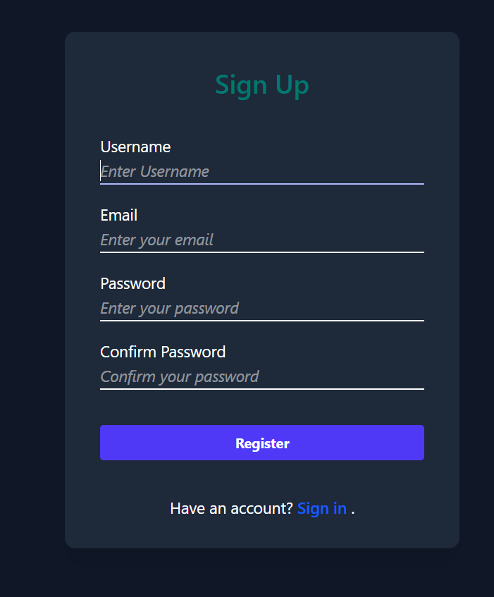
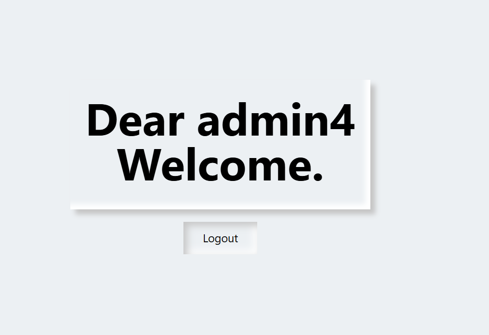

# Authentication Application





---

## Overview
**Authentication Application** is a Django project that demonstrates user authentication features like registration, login, and logout.

---

## Features
- User registration, login, and logout
- Session management
- Redirects after login/logout
- SQLite database
- Ready for local development and GitHub cloning

---

## Tech Stack
- Backend: Django 4.
- Database: SQLite
- Frontend: HTML/CSS (Tailwind)

---

### Prerequisites
- Python 3+
- Django
- Git

### Clone the repository
```bash
git clone https://github.com/Akelvino/Authentication-Application.git
cd Authentication-Application
- Create virtual enviroment 
- Pip install requirements.txt
- python manage.py runserver